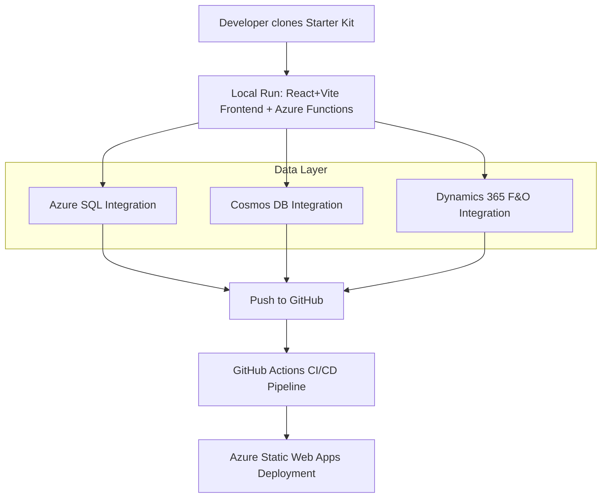

# Functional Design Document (FDD)
**Project:** Starter Kit for Azure Web Apps
**Version:** 1.3
**Date:** September 4, 2025

---

## Document Control
- **Prepared for:** Ashish Patil, Pune
- **Prepared by:** Jules - AI Software Engineer
- **Document Status:** **Final Draft**
- **Confidentiality:** Internal project use only

---

## Executive Summary
The Starter Kit is designed to provide developers with a fully functional foundation for building and deploying web applications on Microsoft Azure. By bundling React (with Vite), Azure Functions (Python), modular database support for **Azure SQL**, **Cosmos DB**, and **Dynamics 365 F&O**, and GitHub Actions into a ready-to-use package, it accelerates onboarding, reduces friction, and encourages best practices in cloud-native development.

---

## Stakeholders
- **Primary Users:** Beginner to intermediate developers with some Azure/React experience.
- **Stakeholders:** Product Owner, Azure Cloud Team, DevOps Team, Mentors/Trainers.

---

## Assumptions, Dependencies, Constraints
- **Assumptions:** Users have a foundational understanding of web development.
- **Dependencies:** Node.js, **Vite**, Azure CLI, Azure Functions Core Tools, GitHub.
- **Constraints:** Deployment supported only on Azure, beginner-friendly design.

---

## Glossary
- **SWA:** Azure Static Web Apps — hosting frontend + APIs.
- **Vite:** High-performance build tool for modern web projects.
- **F&O:** Dynamics 365 Finance & Operations.
- **OData:** Open Data Protocol, a standard for building and consuming RESTful APIs.
- **Azure Functions:** Serverless backend code.
- **Azure SQL:** Cloud-native relational database.
- **Cosmos DB:** Cloud-native NoSQL database.
- **CI/CD:** Automated code build and deployment system.

---

## High-Level Context
The Starter Kit provides an “out-of-the-box” solution for building apps on Azure. It stitches together a React frontend (built with Vite), an Azure Functions API layer, and a modular data layer supporting Azure SQL, Cosmos DB, and Dynamics 365 F&O.

---

## Functional Features (Phase 1)

### Feature 1: Customer Management (SQL Demo)
- **Requirement:** A sample CRUD page for managing a `Customer` list, demonstrating integration with Azure SQL.
- **UI:** A table view of customers with options to add, edit, and delete entries.
- **Acceptance:** A user can successfully create, read, update, and delete customer records.

### Feature 2: Chat History (Cosmos DB Demo)
- **Requirement:** A sample chat component that persists and retrieves conversation history, demonstrating integration with Cosmos DB.
- **UI:** A chat window where a user can type messages and see the conversation history load.
- **Acceptance:** A user can send a message and see it appear in the history, persisted to Cosmos DB.

### Feature 3: F&O Customer Management (OData Demo)
- **Requirement:** A sample CRUD page for managing the `CustomersV3` entity in Dynamics 365 F&O via its OData API.
- **UI:** A table view of F&O customers with options to add, edit, and delete entries.
- **Acceptance:** A user can successfully create, read, update, and delete customer records in F&O.

### Feature 4: Secure Deployment & Onboarding
- **Requirement:** A secure, automated deployment pipeline and a beginner-friendly setup guide.
- **Acceptance:** A new developer can deploy the project to their own Azure subscription in under 1 hour.

---

## Data Models & API Design

### Data Schemas
- **Azure SQL `Customers` Table:** (schema defined in previous version)
- **Cosmos DB `ChatHistory` Item:** (schema defined in previous version)
- **F&O `CustomersV3` Entity:** The schema is defined by the F&O OData metadata. The starter kit will interact with a subset of fields (e.g., `CustomerAccount`, `Name`, `CustomerGroupId`).

### API Endpoints
- **Customer API (Azure Functions):** (endpoints defined in previous version)
- **Chat History API (Azure Functions):** (endpoints defined in previous version)

- **F&O OData API (via Backend Proxy):**
  - **Design Pattern:** The Azure Functions backend will act as a secure proxy for F&O OData calls. The frontend will call simple, well-defined endpoints on the starter kit's API. The backend will handle the complexity of authenticating with F&O and constructing the correct OData queries. This protects F&O credentials from being exposed to the browser.
  - **Endpoints:**
    - `GET /api/fno/customers`: Get a list of customers from F&O.
    - `POST /api/fno/customers`: Create a new customer in F&O.
    - `PUT /api/fno/customers/{id}`: Update a customer in F&O.
    - `DELETE /api/fno/customers/{id}`: Delete a customer in F&O.

---

## Onboarding / Initial Setup
(Diagram and steps from previous version remain valid)

---

## Non-Functional Requirements
- **API Design:** Endpoints must perform **input validation**. List endpoints must use **pagination**.
- **Database:** The starter kit must provide a **database migration tool** (e.g., Knex.js, Alembic) for managing the Azure SQL schema.
- **UI/UX:** All components must handle **loading, empty, and error states** gracefully.
- **Security:** Use Azure Key Vault for all secrets. Implement Role-Based Access Control (RBAC) based on Azure AD groups.
- **Operations:** Provide a `/api/health` health check endpoint for monitoring.
- **Performance:** Page loads in <3s.
- **Reliability:** 95%+ deployment success rate.
- **Code Quality:** Maintainable modular codebase with LTS dependencies.
- **Accessibility:** Basic accessibility (a11y) compliance.

---

## Traceability Matrix (RTM)

| Business Goal | Requirement/Feature | Acceptance Criteria | Status |
|---------------|---------------------|---------------------|--------|
| Ready-to-use foundation | React+Vite frontend, Ant Design | Homepage loads with nav, footer, demos | **Planned (Phase 1)** |
| Modular Data Layer | SQL Customer CRUD Page | User can create/read/update/delete | **Planned (Phase 1)** |
| Modular Data Layer | CosmosDB Chat History Page | User can send/view messages | **Planned (Phase 1)** |
| **Enterprise Integration**| **F&O Customer CRUD Page** | **User can CRUD F&O CustomersV3** | **Planned (Phase 1)** |
| Smooth deployment | CI/CD via GitHub Actions | Push to main triggers deployment | **Planned (Phase 1)** |
| Maintainability & usability | Docs + clean code | Beginner deploys <1hr | **Planned (Phase 1)** |
| Secure by Default | Auth, RBAC, Key Vault | Secure access based on roles | **Planned (Phase 1)** |

---

## Open Issues & Risks
- **Risks:** Beginner struggles, Azure free-tier costs, **F&O OData API complexity**, scaling constraints, misconfigured security.
- **Mitigations:** Docs include troubleshooting, cost awareness, **guidance on F&O authentication**, scaling guidance, security best practices.
